# Master Knowledge Map & Source Mapping

Visual diagram, domain breakdown, capability levels, and mapped learning sources.

```mermaid
graph TD
    KB[Knowledge Base - IT Competency]
    
    KB --> PROG[01. Programming: Java Core & OOP]
    KB --> DSA[02. Data Structures & Algorithms]
    KB --> DB[03. Databases: SQL Server & JDBC]
    KB --> OS[04. Operating Systems & Linux]
    KB --> NET[05. Networking & Network Programming]
    KB --> DEV[06. DevOps Tools: Git & GitHub]

    PROG --> P1[Java Core Syntax & Control Flow - Level 3/5]
    PROG --> P2[OOP Pillars & UML Modeling - Level 3/5]
    PROG --> P3[Java Collections & File I/O - Level 3/5]
    PROG --> P4[Java Swing GUI MVC - Level 3/5]

    DSA --> D1[Big O Time Complexity Basics - Level 3/5]
    DSA --> D2[Arrays & Singly Linked List - Level 2/5]
    DSA --> D3[Trees, Graphs, Advanced Sorting - Level 0/5]

    DB --> DB1[SQL Server 2022 & SSMS - Level 3/5]
    DB --> DB2[Complex Queries, Joins, CTE, Window Functions - Level 3/5]
    DB --> DB3[T-SQL Stored Procedures & Triggers - Level 3/5]
    DB --> DB4[Java JDBC & DAO Architecture - Level 3/5]
    DB --> DB5[ACID, Locks, MVCC, Connection Pool - Level 1/5]

    OS --> OS1[OS Concepts: System Calls, Processes, CPU Sched - Level 3/5]
    OS --> OS2[Linux SysAdmin & Terminal CLI - Level 3/5]
    OS --> OS3[Bash Shell Scripting & Automation - Level 3/5]
    OS --> OS4[Linux System Programming: fork/pthread/epoll - Level 0/5]

    NET --> N1[Java TCP/UDP Socket Programming - Level 3/5]
    NET --> N2[Java Multicast & RMI - Level 3/5]
    NET --> N3[Computer Networking Infra: CIDR/NAT/Wireshark - Level 1/5]

    DEV --> G1[Git CLI Version Control Workflow - Level 4/5]
    DEV --> G2[GitHub Collaboration, Forking & PRs - Level 4/5]
    DEV --> G3[GitHub Actions CI/CD Workflows - Level 0/5]
```

---

## Domain Breakdown & Subskill Capability Summary

> ⚠️ **Aggregate Score Notice**: Aggregate domain scores do not imply equal mastery across all subskills. For example, in Networking, Java Socket Programming is **3/5** while Computer Networking Infrastructure is **1/5**. In Operating Systems, Linux SysAdmin is **3/5** while Linux System Programming is **0/5**. Always evaluate readiness based on the subskill levels below.

| Domain Directory | Subskill Area | Theory | Practical | Troubleshooting | Overall Level | Primary Source |
| :--- | :--- | :---: | :---: | :---: | :---: | :--- |
| [`01-programming/`](../01-programming/summary.md) | Java Core Syntax, Control Flow & I/O | 3/5 | 3/5 | 2/5 | **3/5** | [`SRC-001`](../00-sources/learning-sources.md#src-001) |
| | Java OOP & UML Modeling | 3/5 | 3/5 | 2/5 | **3/5** | [`SRC-001`](../00-sources/learning-sources.md#src-001) |
| [`02-dsa/`](../02-dsa/summary.md) | Arrays & Singly Linked List | 3/5 | 2/5 | 1/5 | **2/5** | [`SRC-002`](../00-sources/learning-sources.md#src-002) |
| | Trees, Graphs & Advanced Sorting | 0/5 | 0/5 | 0/5 | **0/5** | *Untracked Gap* |
| [`03-databases/`](../03-databases/summary.md) | SQL Server Querying, CTE & Window Func | 3/5 | 3/5 | 2/5 | **3/5** | [`SRC-003`](../00-sources/learning-sources.md#src-003) |
| | Java JDBC & DAO Pattern | 3/5 | 3/5 | 2/5 | **3/5** | [`SRC-004`](../00-sources/learning-sources.md#src-004) |
| | Database Concurrency, ACID & Locks | 2/5 | 1/5 | 0/5 | **1/5** | *Tracked Gap* |
| [`04-operating-systems/`](../04-operating-systems/summary.md) | OS Principles (CPU, PCB, Paging) | 3/5 | 2/5 | 1/5 | **3/5** | [`SRC-005`](../00-sources/learning-sources.md#src-005) |
| | Linux SysAdmin & Bash Automation | 3/5 | 3/5 | 2/5 | **3/5** | [`SRC-008`](../00-sources/learning-sources.md#src-008) |
| | Linux System Programming (`fork`/`epoll`) | 1/5 | 0/5 | 0/5 | **0/5** | *Tracked Gap* |
| [`05-networking/`](../05-networking/summary.md) | Java Network Socket Programming | 3/5 | 3/5 | 2/5 | **3/5** | [`SRC-006`](../00-sources/learning-sources.md#src-006) |
| | Computer Networking Infrastructure | 2/5 | 1/5 | 0/5 | **1/5** | *Tracked Gap* |
| [`06-devops-tools/`](../06-devops-tools/summary.md) | Version Control (Git CLI & GitHub PRs) | 4/5 | 4/5 | 3/5 | **4/5** | [`SRC-007`](../00-sources/learning-sources.md#src-007) |
| | CI/CD Automation (GitHub Actions) | 1/5 | 0/5 | 0/5 | **0/5** | *Tracked Gap* |

---

## Master Course Catalog Link
All learning sources are registered and tracked in [`00-sources/learning-sources.md`](../00-sources/learning-sources.md) and indexed in [`00-sources/courses.md`](../00-sources/courses.md).
