# Knowledge Map & Source Mapping

Overview of all learned domains, topics, subtopics, capability levels, and mapped source courses.

```mermaid
graph TD
    KB[Knowledge Base - IT Competency]
    
    KB --> PROG[01. Programming: Java Core & OOP]
    KB --> DSA[02. Data Structures & Algorithms]
    KB --> DB[03. Databases: SQL Server & JDBC]
    KB --> OS[04. Operating Systems & Linux]
    KB --> NET[05. Computer Networking & Java Socket]
    KB --> DEV[06. DevOps Tools: Git & GitHub]

    PROG --> P1[Java Core Syntax & Control Flow - Level 3/5]
    PROG --> P2[OOP Pillars & UML Modeling - Level 3/5]
    PROG --> P3[Java Collections & File I/O - Level 3/5]
    PROG --> P4[Java Swing GUI - Level 3/5]

    DSA --> D1[Big O Time Complexity Basics - Level 3/5]
    DSA --> D2[Arrays & Singly Linked List - Level 2/5]
    DSA --> D3[Trees, Graphs, Advanced Sorting - Level 0/5]

    DB --> DB1[SQL Server 2022 & SSMS - Level 3/5]
    DB --> DB2[Complex Queries, Joins, CTE, Window Functions - Level 3/5]
    DB --> DB3[T-SQL Stored Procedures & Triggers - Level 3/5]
    DB --> DB4[Java JDBC & DAO Architecture - Level 3/5]

    OS --> OS1[OS Concepts: Processes, Threads, CPU Scheduling - Level 3/5]
    OS --> OS2[Linux SysAdmin & Terminal CLI - Level 3/5]
    OS --> OS3[Bash Shell Scripting & Automation - Level 3/5]

    NET --> N1[Networking Fundamentals & InetAddress - Level 3/5]
    NET --> N2[Java TCP Socket Programming - Level 3/5]
    NET --> N3[Java UDP & Multicast Programming - Level 3/5]
    NET --> N4[Network Layer Subnetting CIDR & NAT - Level 1/5]

    DEV --> G1[Git CLI Version Control Workflow - Level 4/5]
    DEV --> G2[GitHub Collaboration, Forking & PRs - Level 4/5]
```

## Domain Breakdown & Source Mapping

| Domain Directory | Domain Name | Overall Level | Theory Level | Practical Level | Primary Source Courses |
| :--- | :--- | :---: | :---: | :---: | :--- |
| [`01-programming/`](file:///e:/myKnownlage/01-programming/summary.md) | Programming (Java) | 3/5 | 3/5 | 2/5 | [`C001`](file:///e:/myKnownlage/00-sources/C001-java-core.md), [`C006`](file:///e:/myKnownlage/00-sources/C006-java-network.md) |
| [`02-dsa/`](file:///e:/myKnownlage/02-dsa/summary.md) | Data Structures & Algorithms | 2/5 | 3/5 | 2/5 | [`C002`](file:///e:/myKnownlage/00-sources/C002-dsa-java.md) |
| [`03-databases/`](file:///e:/myKnownlage/03-databases/summary.md) | Databases (SQL Server & JDBC) | 3/5 | 3/5 | 3/5 | [`C003`](file:///e:/myKnownlage/00-sources/C003-sql-server.md), [`C004`](file:///e:/myKnownlage/00-sources/C004-java-jdbc.md) |
| [`04-operating-systems/`](file:///e:/myKnownlage/04-operating-systems/summary.md) | OS & Linux SysAdmin | 3/5 | 3/5 | 3/5 | [`C005`](file:///e:/myKnownlage/00-sources/C005-os-concepts.md), [`C008`](file:///e:/myKnownlage/00-sources/C008-linux-lpi.md) |
| [`05-networking/`](file:///e:/myKnownlage/05-networking/summary.md) | Networking & Java Sockets | 3/5 | 3/5 | 3/5 | [`C006`](file:///e:/myKnownlage/00-sources/C006-java-network.md) |
| [`06-devops-tools/`](file:///e:/myKnownlage/06-devops-tools/summary.md) | Git & GitHub | 4/5 | 4/5 | 4/5 | [`C007`](file:///e:/myKnownlage/00-sources/C007-git-github.md) |

---

## Master Course Catalog Link
All learning sources are registered and tracked in [`00-sources/courses.md`](file:///e:/myKnownlage/00-sources/courses.md).
