# Master Knowledge Map & Source Mapping

Visual diagram, domain breakdown, capability levels, and mapped learning sources.

```mermaid
graph TD
    KB[Knowledge Base - IT Competency]
    
    KB --> PROG[01. Programming: Java Core & OOP]
    KB --> DSA[02. Data Structures & Algorithms]
    KB --> DB[03. Databases: SQL Server & JDBC]
    KB --> OS[04. Operating Systems & Linux]
    KB --> NET[05. Computer Networking & Network Programming]
    KB --> DEV[06. DevOps Tools: Git & GitHub]

    PROG --> P1[Java Core Syntax & Control Flow - Level 3/5]
    PROG --> P2[OOP Pillars & UML Modeling - Level 3/5]
    PROG --> P3[Java Collections & File I/O - Level 3/5]
    PROG --> P4[Java Swing GUI MVC - Level 3/5]

    DSA --> D1[Big O Time Complexity Basics - Level 3/5]
    DSA --> D2[Arrays & Singly Linked List - Level 2/5]
    DSA --> D3[Trees, Graphs, Advanced Sorting - Level 0/5]

    DB --> DB1[SQL Server 2022 & SSMS - Level 3/5]
    DB --> DB2[Complex Queries, Joins, CTE, Window Functions - Level 3/5]
    DB --> DB3[T-SQL Stored Procedures & Triggers - Level 3/5]
    DB --> DB4[Java JDBC & DAO Architecture - Level 3/5]
    DB --> DB5[ACID, Locks, MVCC, Connection Pool - Level 1/5]

    OS --> OS1[OS Concepts: System Calls, Processes, CPU Sched - Level 3/5]
    OS --> OS2[Linux SysAdmin & Terminal CLI - Level 3/5]
    OS --> OS3[Bash Shell Scripting & Automation - Level 3/5]
    OS --> OS4[Linux System Programming fork/pthread/epoll - Level 0/5]

    NET --> N1[Java TCP/UDP Socket Programming - Level 3/5]
    NET --> N2[Java Multicast & RMI - Level 3/5]
    NET --> N3[Computer Networking Infra CIDR/NAT/Wireshark - Level 1/5]

    DEV --> G1[Git CLI Version Control Workflow - Level 4/5]
    DEV --> G2[GitHub Collaboration, Forking & PRs - Level 4/5]
    DEV --> G3[GitHub Actions CI/CD Workflows - Level 0/5]
```

## Domain Breakdown & Source Mapping

| Domain Directory | Domain Name | Overall Level | Theory Level | Practical Level | Primary Source Courses |
| :--- | :--- | :---: | :---: | :---: | :--- |
| [`01-programming/`](../01-programming/summary.md) | Programming (Java) | **3/5** | 3/5 | 2/5 | [`SRC-001`](../00-sources/learning-sources.md#src-001), [`SRC-006`](../00-sources/learning-sources.md#src-006) |
| [`02-dsa/`](../02-dsa/summary.md) | Data Structures & Algorithms | **2/5** | 3/5 | 2/5 | [`SRC-002`](../00-sources/learning-sources.md#src-002) |
| [`03-databases/`](../03-databases/summary.md) | Databases (SQL Server & JDBC) | **3/5** | 3/5 | 3/5 | [`SRC-003`](../00-sources/learning-sources.md#src-003), [`SRC-004`](../00-sources/learning-sources.md#src-004) |
| [`04-operating-systems/`](../04-operating-systems/summary.md) | OS & Linux SysAdmin | **3/5** | 3/5 | 3/5 | [`SRC-005`](../00-sources/learning-sources.md#src-005), [`SRC-008`](../00-sources/learning-sources.md#src-008) |
| [`05-networking/`](../05-networking/summary.md) | Networking & Java Sockets | **3/5** | 3/5 | 3/5 | [`SRC-006`](../00-sources/learning-sources.md#src-006) |
| [`06-devops-tools/`](../06-devops-tools/summary.md) | Git & GitHub | **4/5** | 4/5 | 4/5 | [`SRC-007`](../00-sources/learning-sources.md#src-007) |

---

## Master Course Catalog Link
All learning sources are registered and tracked in [`00-sources/learning-sources.md`](../00-sources/learning-sources.md) and indexed in [`00-sources/courses.md`](../00-sources/courses.md).
