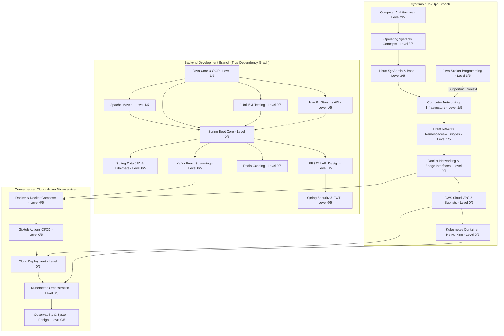

# Dependency-Based Learning Roadmap

Structured, dependency-driven learning path separating **Backend Development** and **Systems / DevOps Infrastructure**, showing how prerequisites build toward convergence in Cloud-Native Backend Engineering.

---

## 🗺️ Dual-Branch Dependency Graph

---

## 🅰️ Branch A: Backend Engineering Roadmap

> 💡 **Dependency Note**: Maven, Streams, and JUnit are peer prerequisites branching from Java Core. They are NOT a sequential linear chain. Once Maven and basic testing foundations are set, Spring Boot development can begin. JPA/Hibernate is a follow-on skill, NOT a blocker to starting Spring Boot.

### Step A.1: Java Foundation Extensions (Parallel Nodes)
- **Node A.1a: Apache Maven** (Prereq: Java Core 3/5)
  - *What to Learn*: `pom.xml`, dependency management, plugins, lifecycle (`clean`, `compile`, `test`, `package`).
  - *Practical Proof*: Package a multi-module Java application into an executable JAR.
- **Node A.1b: Java 8+ Streams API & Lambdas** (Prereq: Java Core 3/5)
  - *What to Learn*: Functional Interfaces (`Predicate`, `Function`), Stream pipelines (`map`, `filter`, `reduce`), `Optional`.
  - *Practical Proof*: Refactor collection processing with Streams pipelines.
- **Node A.1c: Unit Testing (JUnit 5 & Mockito)** (Prereq: Java Core 3/5, Maven)
  - *What to Learn*: `@Test`, `@ParameterizedTest`, Assertions, Mockito mocks (`@Mock`, `when().thenReturn()`).
  - *Practical Proof*: Write JUnit 5 test suites achieving >80% coverage on service logic.

### Step A.2: Spring Boot Core & REST API
- **Prerequisites**: Java Core (3/5), Maven (Step A.1a), basic JUnit testing (Step A.1c).
- **What to Learn**: Dependency Injection (IoC Container), Spring Web MVC (`@RestController`, `@GetMapping`, `@PostMapping`), Request lifecycle, Exception handling (`@RestControllerAdvice`).
- **Practical Proof**: Build a RESTful Web API for product catalog management.

### Step A.3: Spring Data JPA & Database Persistence
- **Prerequisites**: Spring Boot Core (Step A.2), SQL & JDBC foundations (Level 3/5).
- **What to Learn**: `@Entity`, `@Table`, `JpaRepository`, HikariCP connection pool configuration, Transaction management (`@Transactional`).
- **Practical Proof**: Integrate Spring Boot app with SQL Server using Spring Data JPA.

### Step A.4: Advanced Backend Services
- **Spring Security & JWT**: Authentication, authorization, stateless JWT token filters.
- **Redis Caching**: In-memory caching, cache eviction strategies (`@Cacheable`).
- **Kafka Event Streaming**: Producer, Consumer, Topic partitions, event-driven messaging.

---

## 🅱️ Branch B: Systems & DevOps Infrastructure Roadmap

> ⚠️ **Critical Distinction**: Java Socket Programming (Level 3/5) provides application-layer context, but does **NOT** substitute for Computer Networking Infrastructure. Docker Networking depends strictly on Computer Networking fundamentals + Linux networking primitives.

### Step B.1: Computer Networking Infrastructure (CIDR & Diagnostics)
- **Prerequisites**: OS Concepts (Level 3/5), Linux CLI (Level 3/5).
- **Why Needed**: Foundation for container networking, cloud VPCs, and network troubleshooting.
- **What to Learn**: OSI/TCP-IP layers, Ethernet, MAC, ARP, IPv4, CIDR Subnetting (`/24`, `/16`), Routing tables (`ip route`), NAT, ICMP, Wireshark, `tcpdump`.
- **Practical Proof**: Perform Wireshark packet captures of TCP 3-way handshakes and calculate CIDR subnets.

### Step B.2: Linux Network Namespaces & Virtual Bridges
- **Prerequisites**: Linux SysAdmin (Level 3/5), Computer Networking Fundamentals (Step B.1).
- **Why Needed**: Direct prerequisite for understanding Docker bridge networks and port forwarding mechanisms.
- **What to Learn**: `ip netns` (network namespaces), virtual ethernet pairs (`veth`), Linux Bridge interfaces (`ip link add br0 type bridge`), `iptables` NAT masquerading.
- **Practical Proof**: Script the creation of 2 isolated network namespaces connected via a virtual Linux bridge with NAT internet access.

### Step B.3: Docker Containerization & Docker Networking
- **Prerequisites**: Linux CLI (Level 3/5), Linux Network Namespaces (Step B.2).
- **Why Needed**: Essential technology for packaging microservices into container images.
- **What to Learn**: Docker Engine, `Dockerfile` multi-stage builds, Docker volumes, Docker Compose (`docker-compose.yml`), custom bridge networks.
- **Practical Proof**: Containerize a Java backend application and SQL database using Docker Compose.

---

## 🔀 Convergence Node: Cloud-Native Backend Engineering

Once **Step A.2/A.3 (Spring Boot & JPA)** and **Step B.3 (Docker)** are completed, both branches converge:

1. **GitHub Actions CI/CD Pipeline**: Automate building, testing, and containerizing Java apps on commit.
2. **Cloud Infrastructure (AWS/GCP)**: Deploy containerized backend services inside secure VPC subnets.
3. **Kubernetes Orchestration**: Manage container scaling, self-healing, and service discovery.
4. **Observability & System Design**: Implement Prometheus metrics, Grafana dashboards, Distributed Tracing, and High-Availability Architecture design.
