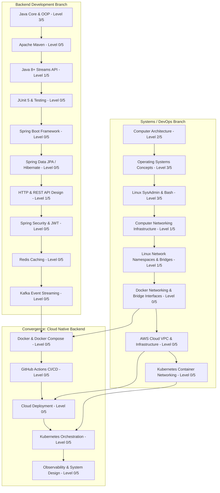

# Dependency-Based Learning Roadmap

Structured, dependency-driven learning path separating **Backend Development** and **Systems / DevOps Infrastructure**, showing how prerequisites build toward convergence in Cloud-Native Backend Engineering.

---

## 🗺️ Dual-Branch Roadmap Architecture

---

## 🅰️ Branch A: Backend Engineering Roadmap

### Step A.1: Apache Maven & Dependency Management
- **Prerequisites**: Java Core & OOP (Level 3/5).
- **Why Needed**: Foundation for Java project structure, dependency resolution, build lifecycles, and Spring Boot packaging.
- **What to Learn**: `pom.xml`, dependency management, plugins, lifecycle phases (`clean`, `compile`, `test`, `package`).
- **Practical Proof**: Package a multi-module Java app into an executable JAR with external dependencies via Maven.

### Step A.2: Java 8+ Streams API & Lambdas
- **Prerequisites**: Java Core & Collections (Level 3/5).
- **Why Needed**: Modern Java backend code bases heavily rely on Streams API and functional programming paradigms.
- **What to Learn**: Functional Interfaces (`Supplier`, `Consumer`, `Function`, `Predicate`), Stream pipelines (`map`, `filter`, `reduce`, `collect`), `Optional`.
- **Practical Proof**: Refactor collection processing logic using Java Streams API.

### Step A.3: Unit Testing (JUnit 5 & Mockito)
- **Prerequisites**: Java Core (Level 3/5), Maven (Step A.1).
- **Why Needed**: Automated test suites are mandatory for verifying service logic and running CI/CD pipelines.
- **What to Learn**: JUnit 5 annotations (`@Test`, `@ParameterizedTest`), Assertions, Mockito mocking framework (`@Mock`, `when().thenReturn()`).
- **Practical Proof**: Write JUnit 5 test suites achieving >80% coverage on service logic.

### Step A.4: Spring Boot & Spring Data JPA Framework
- **Prerequisites**: Maven (Step A.1), Streams (Step A.2), Testing (Step A.3), SQL & JDBC (Level 3/5).
- **Why Needed**: Industry standard framework for modern Java Web & Microservice backends.
- **What to Learn**: Dependency Injection (IoC), Spring Web MVC (`@RestController`), Spring Data JPA (`JpaRepository`), HikariCP connection pool, Exception Handling.
- **Practical Proof**: Build a RESTful Web API for E-commerce product catalog with database persistence.

---

## 🅱️ Branch B: Systems & DevOps Infrastructure Roadmap

### Step B.1: Computer Networking Infrastructure (CIDR & Diagnostics)
- **Prerequisites**: OS Concepts (Level 3/5), Java Socket Programming (Level 3/5).
- **Why Needed**: Prerequisite for Linux container networking, cloud VPCs, and network troubleshooting.
- **What to Learn**: OSI/TCP-IP layers, ARP, IPv4, CIDR Subnetting (`/24`, `/16`), Routing tables, NAT, ICMP, Wireshark, `tcpdump`.
- **Practical Proof**: Perform Wireshark packet captures of TCP 3-way handshakes and perform CIDR subnet calculations.

### Step B.2: Linux Network Namespaces & Virtual Bridges
- **Prerequisites**: Linux SysAdmin (Level 3/5), Networking Fundamentals (Step B.1).
- **Why Needed**: Direct prerequisite for understanding Docker bridge networks and port forwarding mechanisms.
- **What to Learn**: `ip netns` (network namespaces), virtual ethernet pairs (`veth`), Linux Bridge interfaces (`ip link add br0 type bridge`), `iptables` NAT masquerading.
- **Practical Proof**: Script the creation of 2 isolated network namespaces connected via a virtual Linux bridge with NAT internet access.

### Step B.3: Docker Containerization & Docker Networking
- **Prerequisites**: Linux CLI (Level 3/5), Linux Network Namespaces (Step B.2).
- **Why Needed**: Essential technology for packaging microservices into container images.
- **What to Learn**: Docker Engine, `Dockerfile` multi-stage builds, Docker volumes, Docker Compose (`docker-compose.yml`), custom bridge networks.
- **Practical Proof**: Containerize a Java backend application and SQL database using Docker Compose.

---

## 🔀 Convergence Node: Cloud-Native Backend Engineering

Once **Step A.4 (Spring Boot)** and **Step B.3 (Docker)** are completed, both branches converge:

1. **GitHub Actions CI/CD Pipeline**: Automate building, testing, and containerizing Java apps on commit.
2. **Cloud Deployment (AWS/GCP)**: Deploy containerized backend services to Cloud environments.
3. **Kubernetes Orchestration**: Manage container scaling, self-healing, and service discovery.
4. **Observability & System Design**: Implement Prometheus metrics, Grafana dashboards, Distributed Tracing, and High-Availability Architecture design.
