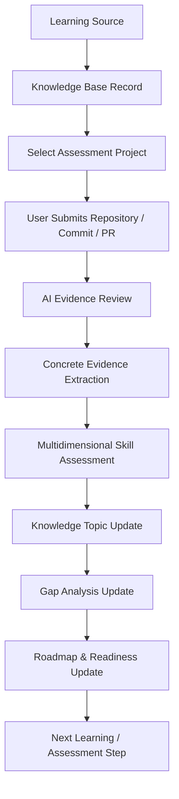

# Project Evidence Assessment System

> **Core Philosophy**: A project is an **assessment instrument**, not merely a portfolio showcase. Completing a course is not mastery, having a repository is not skill, and a claim in a README is not evidence. Evidence must be extracted from verified code, automated tests, Git commits, diagnostic logs, and failure scenario analyses.

---

## 🔄 1. End-to-End Assessment Flow



### The Assessment Lifecycle
1. **Selection**: User chooses an assessment project from [`project-registry.md`](./project-registry.md) to test a specific set of skills or resolve a tracked gap.
2. **Implementation**: User develops the project adhering to the strict requirements, failure scenarios, and acceptance criteria defined in the project instrument file (`P001`–`P006`).
3. **Submission**: User submits the project using the [Project Submission Form](#3-project-submission-template).
4. **AI Review**: AI executes an objective technical review prioritizing tangible artifacts over textual claims.
5. **Evidence Extraction**: AI produces a [Project Assessment Report](#4-ai-project-assessment-report-format) documenting exactly what was proven and what was **NOT** proven.
6. **Synchronization**: AI updates [`project-log.md`](./project-log.md), [`00-dashboard/skill-matrix.md`](../00-dashboard/skill-matrix.md), [`00-dashboard/gap-analysis.md`](../00-dashboard/gap-analysis.md), and [`00-dashboard/learning-roadmap.md`](../00-dashboard/learning-roadmap.md).

---

## 🔍 2. AI Review Priority Hierarchy

When reviewing a submitted project repository, the AI evaluator strictly adheres to the following evidence hierarchy:

```text
1. Repository Structure & Configuration (pom.xml, docker-compose, configs)
      ↓
2. Source Code Implementation (clean architecture, concurrency handling, error safety)
      ↓
3. Automated Tests & Assertions (unit tests, integration tests, concurrency tests)
      ↓
4. Git Commit History (atomic commits, branching, rebasing, meaningful messages)
      ↓
5. CI/CD Workflows (.github/workflows, automated execution status)
      ↓
6. Diagnostic Artifacts (logs, execution plans, strace logs, Wireshark .pcapng captures)
      ↓
7. Failure Scenario Reproduction (demonstrating how bugs occur and are handled)
      ↓
8. README & Documentation (evaluated LAST; claims in README are NOT evidence until verified in code)
```

> [!CAUTION]
> If a claimed feature cannot be verified in code, tests, or diagnostic output, it will be marked as **`Not Verified`**. A claim never converts into competency evidence without proof.

---

## 📋 3. Project Submission Template

When submitting a project for AI evaluation, fill out the following template in the issue, chat, or project log:

```markdown
Project ID: [e.g., P001]
Project Name: [e.g., Java Multi-user Library / Book Lending Server]
Repository URL: [https://github.com/username/repository]
Commit SHA / Branch / PR: [e.g., 7a8b9c0 or main or PR #2]
Date: [YYYY-MM-DD]

### 1. Implementation Overview
- What I implemented: [Brief technical summary]
- Features completed: [List of completed requirements]
- Design decisions & Patterns: [Architecture, DAO, MVC, Threading model]
- Trade-offs made: [Why approach X was chosen over Y]

### 2. Testing & Verification
- Tests written: [List of test classes and methods]
- Tests passing: [Pass count, edge cases tested, test command output]
- Failure scenarios tested: [e.g., simultaneous borrowing race condition]

### 3. Troubleshooting & Debugging Evidence
- Problems encountered: [Specific unexpected behaviors observed]
- Bugs I debugged: [Root cause of the bug]
- How I diagnosed them: [Tools used: debugger, log levels, thread dump, SQL profiler]
- Diagnostic logs / captures attached: [Terminal output, .pcapng, execution plan snippet]

### 4. Git & Engineering Evidence
- Branching workflow used: [feature branch, PR, rebase]
- CI/CD status: [GitHub Actions workflow run link/log]

### 5. Self-Reflection & Limitations
- Known limitations: [Explicit bugs or unhandled edge cases]
- What I think I understand: [Concepts consolidated during implementation]
- What I am still unsure about: [Ambiguities or unverified assumptions]
```

---

## 📊 4. AI Project Assessment Report Format

Upon review, the AI produces an evaluation report using the following canonical structure:

```markdown
# Project Assessment Report: [PROJECT_ID] — [PROJECT_NAME]

- **Repository**: [URL]
- **Commit SHA**: [Hash]
- **Review Date**: [YYYY-MM-DD]
- **Reviewer**: AI Knowledge Base Maintainer

## 1. Implementation Verified
- [Feature / Component]: Verified in `path/to/File.java` (lines L10-L45).

## 2. Theory / Mechanism Evidence
- [Mechanism]: Demonstrated understanding of [concept] via [specific code design].

## 3. Practical Evidence
- [Practical Ability]: Successfully implemented [functionality] under test conditions.

## 4. Troubleshooting Evidence
- [Debugging Ability]: Successfully diagnosed [issue] using [tool/logs].

## 5. Design Evidence
- [Architectural Design]: Decoupled [Layer A] from [Layer B] using [pattern].

## 6. Git / Engineering Evidence
- [Git Hygiene]: Verified atomic commits, clean branch merges, or PR workflows.

## 7. Testing Evidence
- [Automated Verification]: Verified unit/integration tests covering normal and failure modes.

## 8. What Is NOT Proven
- [Explicit Limitation]: The implementation does NOT prove [advanced capability X].

## 9. Bugs / Weaknesses Found
- [Issue]: Unhandled edge case or race condition detected at `path/to/File.java:L88`.

## 10. Evidence Quality
- **Rating**: [Verified / Partial / Not Verified]
- **Justification**: [Summary of proof quality]

## 11. Skill Assessment & Score Adjustments

| Skill / Domain | Dimension | Before | After | Evidence Reference | Confidence |
| :--- | :---: | :---: | :---: | :--- | :---: |
| [Skill Name] | Practical | 3/5 | 4/5 | P001 (commit abc123) | High |

## 12. Knowledge & Dashboard Synchronization Action
- Topic updated: [Link to domain topic file]
- Gap status: [Resolved / Narrowed / Unchanged]
- Roadmap impact: [Node unblocked or updated]
```

---

## 🛡️ 5. Domain Boundary Protection

The assessment system enforces strict domain boundaries during evaluations:

1. **Java Network Sockets $\neq$ Computer Networking**:
   - Building a multi-client TCP/UDP socket server proves Java Socket API and multithreaded connection handling (**Practical 3/5 or 4/5**).
   - It does **NOT** prove understanding of Ethernet, ARP, CIDR subnetting, IP routing, NAT, Wireshark packet capture, or TLS handshakes.
2. **Database Queries & JDBC $\neq$ Concurrency & Database Internals**:
   - Writing complex `SELECT`, `JOIN`, `CTE`, and `PreparedStatement` queries proves query design.
   - It does **NOT** prove understanding of ACID transactions, isolation levels, dirty reads, phantom reads, row/table locks, deadlocks, MVCC, or connection pooling.
3. **Linux Shell Commands $\neq$ Linux Systems Programming & Namespaces**:
   - Using `systemctl`, `ps`, `top`, `ss`, and writing Bash scripts proves SysAdmin capabilities.
   - It does **NOT** prove mastery of POSIX syscalls (`fork`, `exec`), `pthread`, `strace`, `epoll`, network namespaces (`ip netns`), or virtual bridges (`veth`).
4. **Git Version Control $\neq$ CI/CD Automation**:
   - Committing, branching, rebasing, and creating GitHub PRs proves version control hygiene.
   - It does **NOT** prove CI/CD pipeline automation; GitHub Actions is evaluated as a distinct subskill.

---

## 📁 6. Project Registry Index

All assessment instruments and logs are indexed in:
- 📑 [`project-registry.md`](./project-registry.md): Catalog of active, planned, and completed assessment projects.
- 📜 [`project-log.md`](./project-log.md): Historical record of all assessment reviews, submissions, and evidence logs.
- 📐 [`assessment-rubric.md`](./assessment-rubric.md): Detailed grading rubric across all 5 dimensions.
