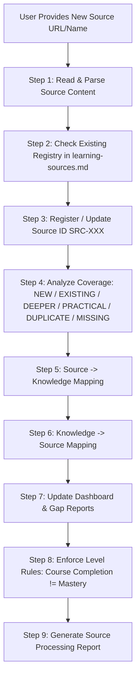

# Source Processing & Knowledge Base Expansion Protocol

Standard Operating Procedure (SOP) for processing any new learning source (Course, Documentation, GitHub repository, YouTube playlist, Book, Lab, or Project) and expanding the Knowledge Base when encountering new knowledge outside the existing framework.

---

## 📌 9-Step Source Processing Pipeline



---

## 📋 Detailed Rules & Guidelines

### Step 1 — Read Source
- Fetch content from URL or parse curriculum items.
- Extract: Name, Provider, Domain, Topic, Subtopics, Concepts, Mechanisms, Practical Skills, Tools, Technologies, Structure, Chapters/Lectures.
- If content cannot be fetched or verified, mark: `Source content: Not verified`. Never fabricate missing content.

### Step 2 — Check Existing Source
- Inspect `00-sources/learning-sources.md` by URL, Source Name, and Provider.
- If source URL exists: Update existing entry (Do NOT create duplicate Source ID).
- If source is new: Assign next sequential ID (`SRC-009`, `SRC-010`, etc.).

### Step 3 — Register Source
Register complete details in `00-sources/learning-sources.md`:
- Source ID
- Domain
- Topic
- Source / Course Name
- Provider
- URL
- Status (`Completed`, `In Progress`, `Planned`, `Reference`)
- Detailed Coverage
- Structure & Lesson links
- Knowledge Mapping links
- Date added

### Step 4 — Coverage Analysis
Classify content into:
- `NEW`: Completely new concepts.
- `EXISTING`: Already present in Knowledge Base.
- `DEEPER`: Previously learned topic, new source dives deeper.
- `PRACTICAL`: Adds hands-on implementation skills.
- `DUPLICATE`: Overlapping content, do not duplicate topic files.
- `MISSING`: Source exposes a related gap in current Knowledge Base.

### Step 5 — Source $\rightarrow$ Knowledge Mapping
Link Source ID to specific Topic files in `01-programming/`, `02-dsa/`, `03-databases/`, `04-operating-systems/`, `05-networking/`, `06-devops-tools/`, or newly expanded domain directories. Update existing topic files or create new ones if strictly necessary.

### Step 6 — Knowledge $\rightarrow$ Source Mapping
In every affected Topic file, add the Source ID (`SRC-XXX`) under `## Sources & Knowledge Traceability` to maintain bidirectional mapping:
```text
SOURCE  <--->  TOPIC  <--->  KNOWLEDGE
```

### Step 7 — Dashboard & Gap Update
Update:
- `00-dashboard/knowledge-map.md`
- `00-dashboard/skill-matrix.md`
- `00-dashboard/gap-analysis.md`
- `00-dashboard/learning-roadmap.md`

### Step 8 — Enforce Skill Level Rules (No Automatic Level Elevation)
- `Course Coverage != Mastery`. Completing a course does NOT automatically grant Level 4 or 5.
- If practical evidence is lacking:
  - `Theory: Verified`
  - `Practical: Not verified`
  - `Troubleshooting: Not verified`
  - `Design: Not verified`

### Step 9 — Standard Processing Report Format
After processing any new source, generate a structured report:

```text
Source Added: SRC-XXX
Source: <Name>
URL: <URL>
New Knowledge: ...
Existing Knowledge: ...
Deepened Knowledge: ...
Practical Knowledge: ...
Duplicate: ...
Knowledge Gaps: ...
Prerequisite Gaps: ...
Files Updated: ...
Recommended Next: ...
```

---

## 🏗️ Handling Knowledge Outside Existing Framework (Knowledge Base Expansion)

The Knowledge Base must be extensible and reflect what the user actually learns rather than initial structural assumptions.

```text
New Knowledge
     ↓
Verify Existence
     ↓
Classify (EXISTING / DEEPER / PRACTICAL / NEW)
     ↓
Place in Existing Subdomain / Topic
     ↓
OR Create New Topic in Existing Domain
     ↓
OR Create New Domain (e.g., 07-ai/)
     ↓
Update Source Mapping (learning-sources.md)
     ↓
Update Skill Matrix & Gap Analysis
     ↓
Update Roadmap & Dashboard System
     ↓
Generate Knowledge Expansion Report
```

### Expansion Rules & Protocols

1. **Verify Existence First**: Check `knowledge-map.md`, existing topics, domain directories, `skill-matrix.md`, and `learning-sources.md` before creating new structures.
2. **Expand Within Existing Subdomains**: If new knowledge belongs to an existing domain (e.g. `gRPC` inside `Backend`), create subtopic files within that domain directory rather than introducing unnecessary top-level domains.
3. **Expand Within Existing Domains**: If new knowledge does not fit existing topics but fits an existing domain (e.g. `Nginx` inside `06-devops-tools/`), create a new topic file (e.g. `06-devops-tools/nginx.md`).
4. **Create New Domains Controlledly**: If new knowledge belongs to a completely new domain (e.g. Machine Learning, LLMs, Vector DBs), create a new numbered domain directory (e.g. `07-ai/`) and register it officially in `README.md` and `knowledge-map.md`.
5. **Avoid Keyword-driven Folder Creation**: Mentioning a technology as a reference or prerequisite does NOT justify creating a new domain directory. Mark it as `Reference / Prerequisite`.
6. **Record Knowledge Regardless of Current Roadmap Goals**: If new knowledge is outside current primary goals (e.g., Blockchain while focusing on Backend/DevOps), register the source and knowledge, assign `Learning Priority: Low / Optional`, and do not alter primary roadmap sequencing.
7. **Distinguish Knowledge Existence vs Learning Priority**: Never delete recorded knowledge simply because it has low roadmap priority.
8. **Dependency & Prerequisite Audit**: Audit prerequisite gaps for all new topics/domains. Learning a high-level concept does NOT imply prerequisites are mastered.
9. **Systemic Consistency**: Synchronize all system files (`README.md`, `knowledge-map.md`, `skill-matrix.md`, `gap-analysis.md`, `learning-roadmap.md`, `learning-sources.md`) simultaneously whenever expanding structures.
10. **Controlled Expansion, No Blanket Restructure**: Preserve existing folder structures and taxonomy. Prefer extending existing folders over massive renaming/relocating.
11. **Knowledge Expansion Report Format**: Include a standard `## Knowledge Expansion` section in response reports:

```text
## Knowledge Expansion

New Domain: <Domain Name>
New Topic: <Topic Name>
Why Created: <Rationale>
Parent Domain: <Parent Domain>
Related Existing Topics: <Topics>
Prerequisites: <Prerequisites>
Learning Priority: <High / Medium / Low / Optional>
Files Created: <List of new files>
Files Updated: <List of updated files>
```
