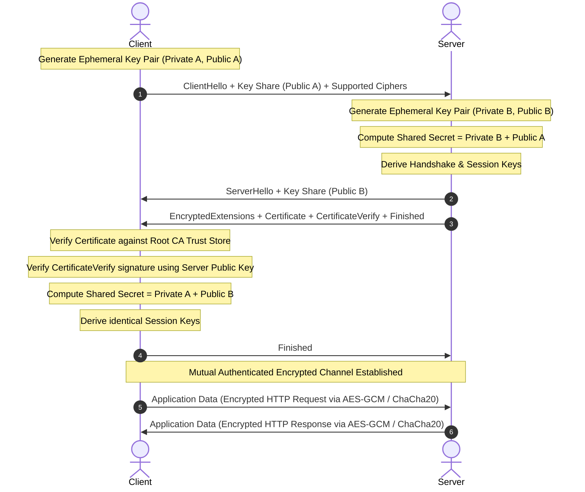

# HTTP, HTTPS, TLS Handshake & Modern Transport (QUIC / HTTP/3)

## Status
- **Overall Level**: 2/5
- **Theory**: 3/5
- **Practical**: 1/5
- **Troubleshooting**: 1/5
- **Design**: 2/5
- **Confidence**: Medium
- **Evidence Status**: Partial (Mechanism understood in depth; packet-level Wireshark capture and JSSE code implementation pending in [`P003`](../00-projects/P003-network-packet-investigation.md))

---

## 1. HTTP, HTTPS & The Core Role of TLS

### HTTP vs HTTPS
- **HTTP (HyperText Transfer Protocol)**: Application-layer protocol defining the request/response message exchange between client and server in plaintext.
- **HTTPS**: **`HTTP + TLS`** (HTTP running over an encrypted Transport Layer Security channel).

### The 4 Core Responsibilities of TLS
1. **Authentication**: Verifying that the server is genuinely who it claims to be (preventing impersonation / Man-in-the-Middle).
2. **Key Exchange**: Securely agreeing upon shared symmetric encryption keys across an untrusted network without transmitting the secret itself.
3. **Encryption**: Transforming plaintext application data into ciphertext using high-speed symmetric ciphers.
4. **Integrity**: Guaranteeing that data has not been modified, truncated, or tampered with in transit (via MAC / AEAD ciphers).

> ⚠️ **Critical Misconception**: HTTPS is **NOT** simply "Client uses Server's Public Key to encrypt all HTTP data, and Server uses Private Key to decrypt". Asymmetric encryption (RSA/ECC) is computationally expensive. Asymmetric cryptography is used **only during the handshake** for authentication and key agreement. The actual HTTP payloads are encrypted using high-performance **symmetric session keys** (AES-GCM or ChaCha20-Poly1305).

---

## 2. TLS Handshake Architecture (TLS 1.3 / ECDHE)

### End-to-End Handshake Flow



---

## 3. Server Certificate & CA Trust Chain

### Structure of an X.509 Certificate
A server certificate contains public identity and cryptographic proof:
```text
Certificate
├── Domain Name (Common Name / Subject Alternative Name: example.com)
├── Server Public Key
├── Validity Period (Not Before / Not After)
├── Issuer Information (Intermediate CA)
└── CA Digital Signature
```
- **Public Key**: Publicly distributed to all connecting clients.
- **Private Key**: Held strictly secret on the server; **NEVER** sent over the wire.
- **Purpose**: A Certificate acts as cryptographic proof binding a specific **Domain Name $\leftrightarrow$ Server Public Key**.

### Certificate Authority (CA) & Trust Store
How does a client know a certificate isn't forged?
1. The operating system, browser, or JVM maintains a pre-installed **Trust Store** containing well-known **Root CAs**:
   ```text
   Client Trust Store
   ├── Root CA A (DigiCert, Let's Encrypt, etc.)
   ├── Root CA B
   └── Root CA C
   ```
2. The CA signs the server certificate using the **CA's Private Key**.
3. The client verifies the signature using the **CA's Public Key** already embedded in its Trust Store.
4. Chain of Trust:
   $$\text{Root CA} \xrightarrow{\text{signs}} \text{Intermediate CA} \xrightarrow{\text{signs}} \text{Server Certificate} \xrightarrow{\text{contains}} \text{Server Public Key}$$

---

## 4. Certificate vs CertificateVerify: The Crucial Difference

| Artifact | What it States / Proves | Cryptographic Mechanism |
| :--- | :--- | :--- |
| **`Certificate`** | *"Here is the public key that belongs to `example.com`."* | Signed by the **CA's Private Key**; verified using the CA's Public Key. |
| **`CertificateVerify`** | *"I prove that I physically possess the Private Key corresponding to that Certificate."* | The server takes the hash of the entire preceding handshake transcript and signs it using the **Server's Private Key**. The client verifies this signature using the Server's Public Key extracted from the Certificate. |

> Without `CertificateVerify`, an attacker could replay a legitimate public certificate of `google.com` to you, but they would fail the handshake because they cannot sign the handshake transcript without Google's private key.

---

## 5. ECDHE & Session Key Derivation

### Elliptic Curve Diffie-Hellman Ephemeral (ECDHE)
Neither party transmits their private keys or the secret over the wire:

1. **Client generates**: Ephemeral Private Key $a$, Ephemeral Public Key $A = a \cdot G$.
2. **Server generates**: Ephemeral Private Key $b$, Ephemeral Public Key $B = b \cdot G$.
3. **Public Exchange**: Client sends $A \rightarrow$ Server; Server sends $B \rightarrow$ Client.
4. **Mathematical Derivation**:
   - Client calculates: $S = a \cdot B = a \cdot (b \cdot G)$
   - Server calculates: $S = b \cdot A = b \cdot (a \cdot G)$
   - Both arrive at the **exact same Shared Secret $S$** without ever transmitting $S$ across the network.
5. **Key Derivation (HKDF)**:
   $$\text{Shared Secret } S \xrightarrow{\text{HKDF}} \text{Session Keys (Client Write Key, Server Write Key, IVs)}$$
6. **Symmetric Encryption**:
   - The session keys power authenticated symmetric encryption ciphers: **AES-GCM** or **ChaCha20-Poly1305**.
   - These keys encrypt the actual HTTP requests and responses.

---

## 6. Java HTTPS & JSSE (Java Secure Socket Extension)

Java provides full native TLS support through the **JSSE** framework.

### Architecture in Java
```text
Certificate + Private Key 
       ↓
Keystore (.jks / .p12)
       ↓
KeyManagerFactory & TrustManagerFactory
       ↓
SSLContext
       ↓
SSLServerSocketFactory / SSLSocketFactory
       ↓
SSLServerSocket / SSLSocket
```

### Server Implementation Example
```java
// Initialize TLS SSLContext
SSLContext sslContext = SSLContext.getInstance("TLS");
sslContext.init(keyManagerFactory.getKeyManagers(), trustManagerFactory.getTrustManagers(), null);

// Create TLS Server Socket
SSLServerSocket server = (SSLServerSocket) sslContext
    .getServerSocketFactory()
    .createServerSocket(8443);

// Client connects: Java JSSE automatically handles the entire TLS Handshake
SSLSocket clientSocket = (SSLSocket) server.accept();

// Application reads decrypted HTTP plaintext directly from inputStream
BufferedReader reader = new BufferedReader(new InputStreamReader(clientSocket.getInputStream()));
String httpRequestLine = reader.readLine(); // "GET / HTTP/1.1"
```

### The Decoupling of Concerns
```text
Network Packet Arrival
       ↓
Transport Layer: TCP / QUIC
       ↓
Security Layer: TLS (Decryption & Integrity Check)
       ↓
🔓 Decrypted Plaintext Stream
       ↓
Java Application Layer (Receives standard HTTP Request)
```

---

## 7. Evolution: HTTP/1.1 vs HTTP/2 vs HTTP/3

```text
                  APPLICATION LAYER
                          │
               ┌──────────┴──────────┐
               │                     │
           HTTP/1.1                HTTP/3
           HTTP/2                    │
               │                   QUIC
              TLS                    │
               │                    UDP
              TCP                    │
               │                     │
               └───────── IP ────────┘
```

| Dimension | HTTP/1.1 | HTTP/2 | HTTP/3 |
| :--- | :--- | :--- | :--- |
| **Transport Layer** | TCP | TCP | **QUIC** (over UDP) |
| **Security Layer** | TLS (Optional / External) | TLS 1.2+ (Practically required) | **TLS 1.3 Integrated into QUIC** |
| **Multiplexing** | No (Head-of-Line blocking at HTTP level; requires multiple TCP connections) | **Yes** (Multiplexed binary streams over 1 TCP connection) | **Yes** (Independent streams over QUIC; zero cross-stream blocking) |
| **Transport Head-of-Line Blocking** | Suffers if TCP packet lost | Suffers: A single lost TCP packet stalls **all** streams | **Eliminated**: Lost packet only stalls its individual stream |
| **Connection Setup Latency** | 1 RTT (TCP) + 2 RTT (TLS) = 3 RTT | 1 RTT (TCP) + 1-2 RTT (TLS) = 2-3 RTT | **1 RTT** (Combined QUIC + TLS 1.3) or **0 RTT** resumption |
| **Connection Migration** | Broken on IP/Network change | Broken on IP/Network change | **Supported** via 64-bit Connection ID |

---

## 8. TCP vs UDP vs QUIC

### TCP (Transmission Control Protocol)
- **Features**: Connection-oriented, guaranteed delivery, strict packet ordering, retransmission timeouts, flow control (Sliding Window), congestion control (Cubic/BBR).
- **Limitation**: Connection is strictly identified by a **4-tuple**:
  $$\{\text{Client IP}, \text{Client Port}, \text{Server IP}, \text{Server Port}\}$$
  If a mobile device switches from **Wi-Fi (`192.168.1.10`)** to **Cellular 4G/5G (`10.20.30.40`)**, the client IP changes $\rightarrow$ the TCP 4-tuple breaks $\rightarrow$ connection resets $\rightarrow$ full reconnect required.

### UDP (User Datagram Protocol)
- **Features**: Connectionless, lightweight, no delivery guarantee, no ordering, no retransmissions.
- **Role**: Fast, low-latency transport foundation.

### QUIC (Quick UDP Internet Connections)
- **Design**: QUIC runs on top of UDP in user-space, but implements its own robust transport mechanics:
  - Reliability & Selective Acknowledgments (SACK)
  - Congestion control & flow control per stream
  - Native multiplexing without TCP Head-of-Line blocking
  - Native TLS 1.3 encryption embedded into handshake

### Connection Migration in QUIC
Instead of relying on the 4-tuple IP/Port, QUIC identifies a connection using an independent **Connection ID**:
```text
Mobile Phone on Wi-Fi:
[IP: 192.168.1.10] ──── QUIC Connection ID: #ABC-123-XYZ ────> Server

User walks out of the house -> Switches to Cellular 4G:
[IP: 10.20.30.40]  ──── QUIC Connection ID: #ABC-123-XYZ ────> Server
```
- The server identifies the session by **Connection ID `#ABC-123-XYZ`**, not the IP address.
- Active downloads, video calls, or HTTP/3 streams **continue seamlessly without dropping or renegotiating TLS**.

---

## 9. What I Understand (Mechanisms & Principles)
- Why HTTPS cannot rely solely on asymmetric encryption (computational cost and cipher block limits).
- How the CA Trust Store prevents man-in-the-middle attacks through mathematical signature chains.
- The precise role of `CertificateVerify` in proving active ownership of the server's private key.
- How ECDHE mathematically computes an identical shared secret on both ends without transmitting the secret over the wire.
- The fundamental structural differences across HTTP/1.1, HTTP/2, and HTTP/3.
- How QUIC solves TCP's two biggest architectural flaws: Head-of-Line blocking across streams and connection teardown during mobile IP roaming.

## 10. What I Can Do
- Trace and articulate the complete TLS 1.3 handshake packet flow step-by-step.
- Differentiate between asymmetric authentication and symmetric bulk encryption.
- Explain the role and Java JSSE classes (`SSLContext`, `SSLServerSocket`, `KeyStore`).
- Compare protocol trade-offs between TCP, UDP, and QUIC for real-world application architectures.

## 11. What I Cannot Yet Do (Gaps to Validate in Lab)
- Capture and inspect a live TLS 1.3 handshake packet-by-packet in Wireshark (`ClientHello`, `ServerHello`, encrypted extension frames) $\rightarrow$ *Target of [`P003`](../00-projects/P003-network-packet-investigation.md)*.
- Configure a self-signed certificate and mutual TLS (mTLS) in a working Java `SSLServerSocket` application.
- Decrypt TLS session traffic in Wireshark using an exported `SSLKEYLOGFILE`.

---

## 12. Sources & Traceability
- **Self-Directed Study**: Technical consolidation of modern web protocols (HTTP, TLS 1.3, X.509, ECDHE, QUIC, HTTP/3).
- **Target Practical Assessment**: [`00-projects/P003-network-packet-investigation.md`](../00-projects/P003-network-packet-investigation.md).
